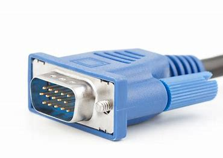

# FRC Glossary

## Engineering


Engineering这部分程序组也要看


diagonal cutter n. 斜口钳

solder v. 焊接

tin n. 锡 v. 镀锡

shaft n. 转轴

rotary shaft 转轴

## Control System

actuator n. 驱动器

motor n. 电机

motor controller 电机控制器

port n. 端口，端口号

pin n. 针脚，插针

shaft n. 转轴

rotary shaft 转轴

### Sensors

accelerometer: A common sensor used to measure acceleration in one or more axis. 加速度计

gyroscope: A device that measures rate of rotation. It can add up the rotation measurements to determine the direction of the robot. \(“gyro”, for short\) 陀螺仪

ultrasonics 超声波传感器（用于测距）

encoder 编码器 Encoders are devices used to measure motion \(usually, the rotation of a shaft\).

## Programming

